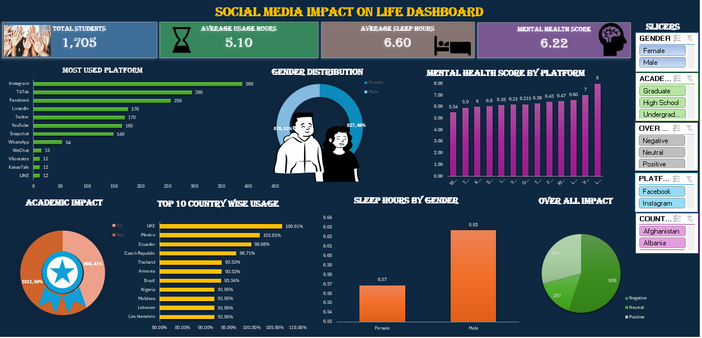

# Social Media Impact Dashboard

## Project Overview

The Social Media Impact Dashboard is an interactive data analysis project developed using Microsoft Excel. The dashboard provides a comprehensive analysis of social media performance by tracking key engagement metrics, audience growth, and platform performance.

The main objective of this project is to transform raw social media data into meaningful insights that help understand user engagement, content performance, and audience behavior. By using Excel's advanced features such as Pivot Tables, Pivot Charts, Slicers, Conditional Formatting, and Dashboard Design, the project presents business insights in a clear and interactive format.

This dashboard demonstrates my ability to clean, organize, analyze, and visualize data using Microsoft Excel.

---

# Project Objectives

The objectives of this project are:

- Analyze overall social media performance.
- Measure audience engagement across different platforms.
- Compare likes, comments, shares, and impressions.
- Identify top-performing social media content.
- Track audience growth over time.
- Create an interactive dashboard for better decision-making.
- Present data in a visually appealing and easy-to-understand format.

---

# Tools & Technologies Used

- Microsoft Excel
- Pivot Tables
- Pivot Charts
- Slicers
- Conditional Formatting
- Excel Formulas
- Data Cleaning
- Data Visualization

---

# Data Preparation

The dataset was prepared using the following steps:

- Imported the dataset into Microsoft Excel.
- Removed duplicate records.
- Handled missing values.
- Corrected data formatting.
- Organized the dataset into structured tables.
- Created calculated fields where required.
- Prepared the data for dashboard visualization.

---

# Dashboard Features

The dashboard includes:

### KPI Cards

- Total Posts
- Total Likes
- Total Comments
- Total Shares
- Total Impressions
- Total Engagement

### Visualizations

- Platform-wise Performance
- Monthly Engagement Trend
- Likes vs Comments Analysis
- Top Performing Platforms
- Audience Growth Analysis
- Engagement Distribution

### Interactive Features

- Dynamic Slicers
- Interactive Charts
- Filters
- Easy Navigation

---

# Key Insights

The dashboard helps identify:

- Best-performing social media platform.
- Highest engagement period.
- Most engaging content.
- Audience growth trend.
- Platform comparison.
- Overall marketing performance.

---

# Skills Demonstrated

- Data Cleaning
- Data Analysis
- Excel Dashboard Design
- Pivot Tables
- Pivot Charts
- Data Visualization
- Business Reporting
- Analytical Thinking
- Problem Solving

---

# Files Included

- Social-Media-Impact-Dashboard.xlsx
- Dashboard.png
- README.md

---

# Business Value

This dashboard helps marketing teams monitor campaign performance, evaluate audience engagement, compare social media platforms, and make data-driven marketing decisions.

---

# Conclusion

The Social Media Impact Dashboard demonstrates how Microsoft Excel can be used to transform raw social media data into meaningful business insights. It highlights my skills in Excel dashboard development, data visualization, and analytical reporting.

---

## Dashboard Preview

